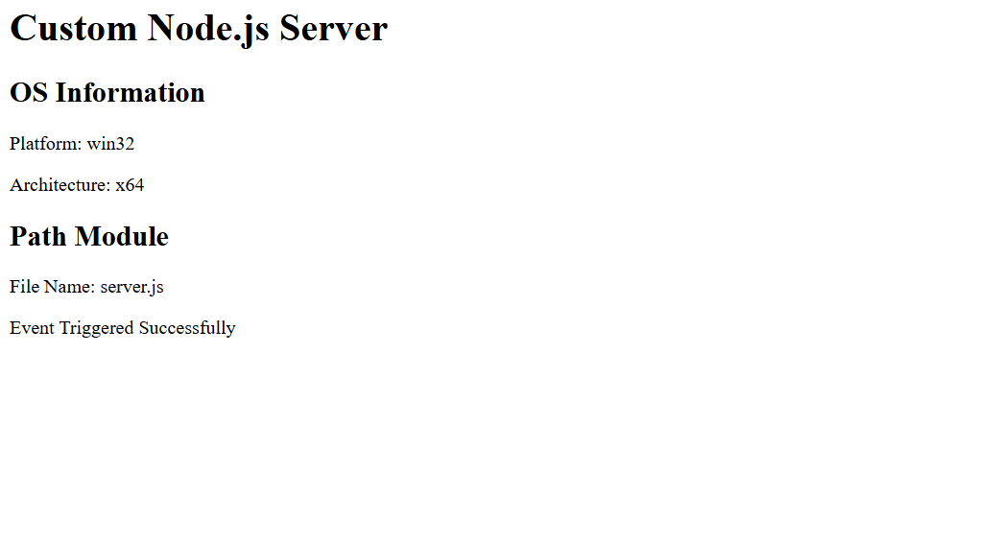
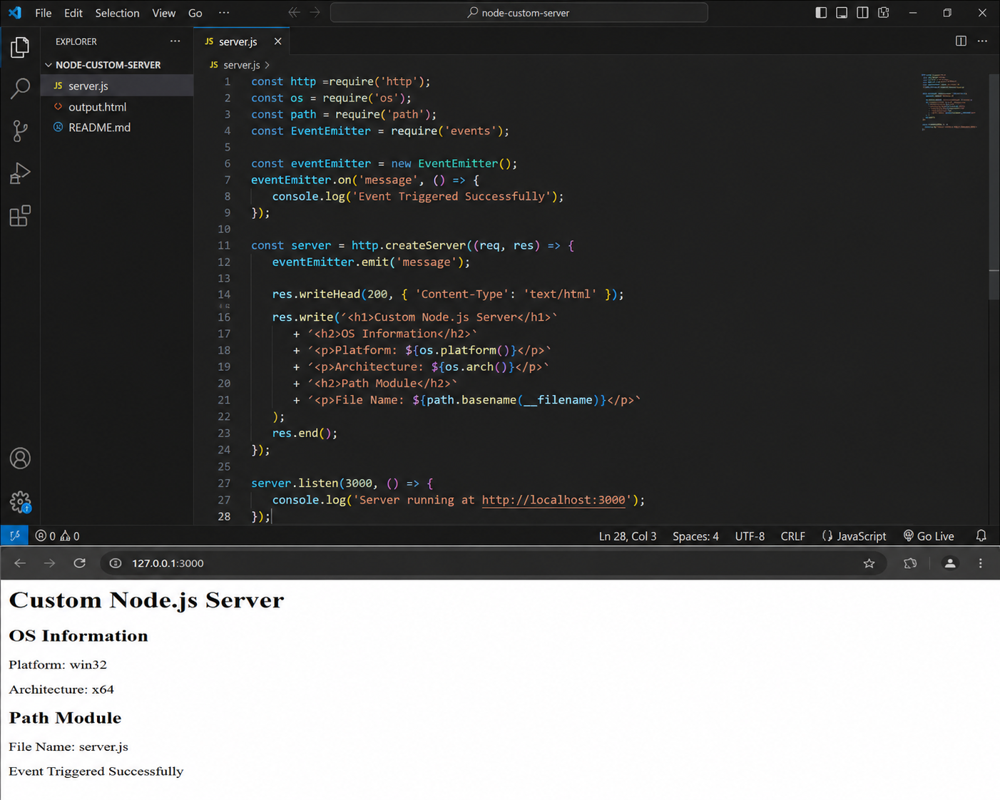

# Custom Server using Node.js

## Aim
To create a custom server using Node.js http module and explore OS, path, and event modules.

## Modules Used
- http
- os
- path
- events

## Features
- Custom HTTP server
- Display OS information
- Display file path information
- Event handling using EventEmitter

## Files Included
- server.js
- output.html

## Output Screenshots

### VS Code Output

### Browser Output

## GitHub Repository Link

https://github.com/malikabrar1897/node-custom-server
